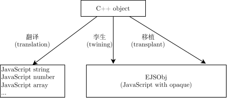

JavaScript 绑定
****************

C++ 值或引用转换为 JavaScript 值的方式
==========================================

将 C++ 值转换为 JavaScript 值，有「翻译」「孪生」「移植」三种方式。ElementQuickJsBinding 具有通用的转换函数 ``cpp2Js`` 以及其 variant 版本 ``cppVariant2Js``，可将 C++ 值转换为 JavaScript 值。对于一个 C++ 值，ElementQuickJsBinding 会按照以下规则决定采用哪种方式：

* 对于任意 ``T``：

  * 对于数值类型（如 ``int``, ``float``, ``char`` 等），翻译为 JavaScript ``number``。
  * 对于 ``std::string``, ``char *``，翻译为 JavaScript ``string``。
  * 对于任何时间长度类型（如 ``std::chrono::duration`` 等），翻译为 JavaScript ``number``。
  * 对于任何时间点类型（如 ``std::chrono::time_point`` 等），翻译为 JavaScript ``Date``。
  * 对于一切容器，均翻译为 JavaScript ``Array``，其构成元素为 C++ 容器中的元素经过 ``cpp2Js`` 转换后的结果。
  * 对于用户自定义的结构体或类：

    * 如果该结构体或类是 *可翻译* 的，则翻译，否则移植。

* 对于除了 ``char *`` 以外的任意 ``T *`` 以及 ``std::reference_wrapper<T>``：均采用孪生方式。

概念: *可翻译*
------------------

可翻译的对象主要用于纯数据类型，我们希望 a) 它不需要经由 EJSObj 这一中间介质；b) 这种对象在 JS 中有不同于 C++ 的表示。

一个 C++ 结构体或类是 *可翻译* 的，如果：

* 该结构体使用 regType 注册，且满足 ``EJS::Translatable`` 概念。若如此，ElementQuickJsBinding 在翻译此类型变量时将会利用指定的 ``translateToJS`` 函数，将这种 JavaScript 对象转换为 C++ 值时，会调用指定的 ``detranslate`` 来将 JavaScript 对象转换为 C++ 值。``detranslate`` 必须进行有效性校验，并在不符合要求时抛出异常。
* 该结构体使用 regType 注册，且 ``EJS::CompileTimeMeta<T>::autoTranslateViaReflectpp`` 为编译期真。若如此，ElementQuickJsBinding 在翻译此类型变量时将会利用 ``reflectpp`` 库转换为 rfl::Generic，然后转换为 JavaScript 对象；在将这种 JavaScript 对象转换为 C++ 值时，会利用 ``reflectpp`` 库将 JavaScript 对象转换为 rfl::Generic，然后反序列化为 C++ 值。
* 该结构体使用 regTypeDyn 注册，且提供了 translator。

转换方法：孪生（Twining）
------------------------------

「孪生」就如同「数字孪生」一词中的「孪生」。将 C++ 对象孪生后得到的结果称为「孪生体」（twin）。一个 C++ 对象的孪生体如同它在 JavaScript 中的分身。

孪生体具有与原对象相同名称的代理属性。

EJSObj
------------------

通过「移植」以及「孪生」转换出来的 JavaScript 对象，均为 “EJSObj”。EJSObj 是一种具有特定 opaque 的 JavaScript 对象，它的 opaque 中保存着关联的 C++ 对象的相关信息。

如果 EJSObj 是「移植」得来的，则其 opaque 中保存被移植的 C++ 对象本身。这是将源对象通过移动或复制构造实现的，见？？。如果 EJSObj 是「孪生」得来的，则其 opaque 中保存被孪生的 C++ 对象的引用，见？？。

被移植的 C++ 对象和被孪生的 C++ 对象统称为「关联的 C++ 对象」「关联对象」。

属性
~~~~~~~~~~~~~~~~~~~~~~

每当 JavaScript 代码尝试访问 EJSObj 的属性时，ElementQuickJsBinding 会获取关联 C++ 对象的属性值，然后转换为 JavaScript 类型并返回给 JavaScript 代码。

每当 JavaScript 代码尝试设置 EJSObj 的属性时（假设设置属性 prop 为 value），ElementQuickJsBinding 将首先将 value 转换为 C++ 类型，然后按照顺序查找遍历 prop 的所有 operator= 重载，直到找到一个可以将 value 转换为其参数的重载，最后调用该重载设置属性。

.. pcode::
   :linenos:

   \begin{algorithm}
   \begin{algorithmic}
      \STATE $cppValue = $ \CALL{jsToCpp}{$value$}
      \STATE $assignOps = $ $prop$ 的所有 operator= 重载
      \FOR{$assignOp$ in $assignOps$}
         \IF{$cppValue$ 可以转换为 $assignOp$ 的参数类型}
            \STATE $assignOp$($cppValue$)
         \ENDIF
      \ENDFOR
      \STATE \textbf{error}{找不到合适的 operator= 重载，无法设置属性 $prop$ 为 $cppValue$}
   \end{algorithmic}
   \end{algorithm}

返回值处理
~~~~~~~~~~~~~~~~~~~~~~

当 JavaScript 调用了 EJSObj 的函数，且函数有返回值，ElementQuickJsBinding 会先调用函数，然后如此处理返回值：

*  如果返回值为 ``T &``，则将之包装为 ``std::reference_wrapper<T>``，然后执行 ``cpp2VariantJs`` 转换，返回给 JavaScript 代码。
*  如果返回值为 ``T *`` 或 ``std::reference_wrapper<T>`` 或 ``T``，则直接执行 ``cpp2VariantJs`` 转换，返回给 JavaScript 代码。

有效性和生命周期
~~~~~~~~~~~~~~~~~~~~~~

如果通过 ``cpp2Js`` 转换且该结构体或类满足 ``EJS::LifetimeAware``，或通过 ``cppVariant2Js`` 转换并传入了 ``Rc<LifetimeInfo>`` （？），则该孪生体在被 JavaScript 使用时会判断源对象是否被销毁或移动。如果源对象被销毁或移动，则会抛出 JavaScript 异常，从而避免非法内存访问。

若非，则该孪生体在被 JavaScript 使用时不会判断源对象是否被销毁或移动，需要用户手动确保内存安全。

如果某个 C++ 对象的成员函数返回了一个引用或指针，该引用或指针将被孪生处理，且不满足概念「生命周期可感知」，则孪生的 EJSObj 的有效生命周期将会视为与这个 C++ 对象一致。

驱动程序（Driver）
---------------------

ElementQuickJsBinding 提供一种机制，允许用户说明对于同一类类，均有哪些共同的函数或属性可供 JavaScript 侧调用。该功能在类模板上尤其有用。

（未定）

.. code-block:: C++
   :linenos:

   // https://en.cppreference.com/cpp/named_req/ContiguousContainer
   template <typename C>
   concept ContiguousContainer = requires(C c) {
      { c.data() } -> std::same_as<typename C::pointer>;
      { c.size() } -> std::convertible_to<std::size_t>;
      // Ensure elements are stored contiguously
      requires std::contiguous_iterator<typename C::iterator>;
   };

   template <ContiguousContainer T>
   class ContiguousContainerDriver
   {
      // ？？？如何告知 ElementQuickJsBinding 所有可对 std::vector<T> 的操作？
      // 这样吗？
      static const metapp::MetaClass getMethods() {
         static const metapp::MetaClass metaClass{
            metapp::getMetaType<T>(),
             {
               mc.registerCallable("add",  {
                  vec.push_back(std::move(value));
               });
            }
         };
      }
   };

   regClass<std::vector<A>, ContiguousContainerDriver>(...);
   regClass<std::vector<B>, ContiguousContainerDriver>(...);